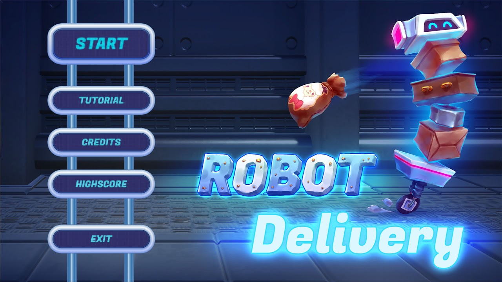

[Play on fsi.rocks](http://gamedevweek.pages.fsi.rocks/ws-18_19/unity/delivery-robot/)

# Intro
Find the perfect balance! With blazing speed and a full load of packages, you too will become part of Robot Delivery.

# How to play
[Play on fsi.rocks](http://gamedevweek.pages.fsi.rocks/ws-18_19/unity/delivery-robot/)
# Controls
Adjust balance: arrow up

jump: space

move: left / right arrows

# Fun Facts
This game was created as part of the GameDevWeek Trier. This is a GameJam of the University of Trier, so to speak, which lasts one week (duh). In this project there were nine of us. My task was among other things to lead the team and implement the highscore and adjustments to the UI. I also worked on the logic and physics of the packages.

